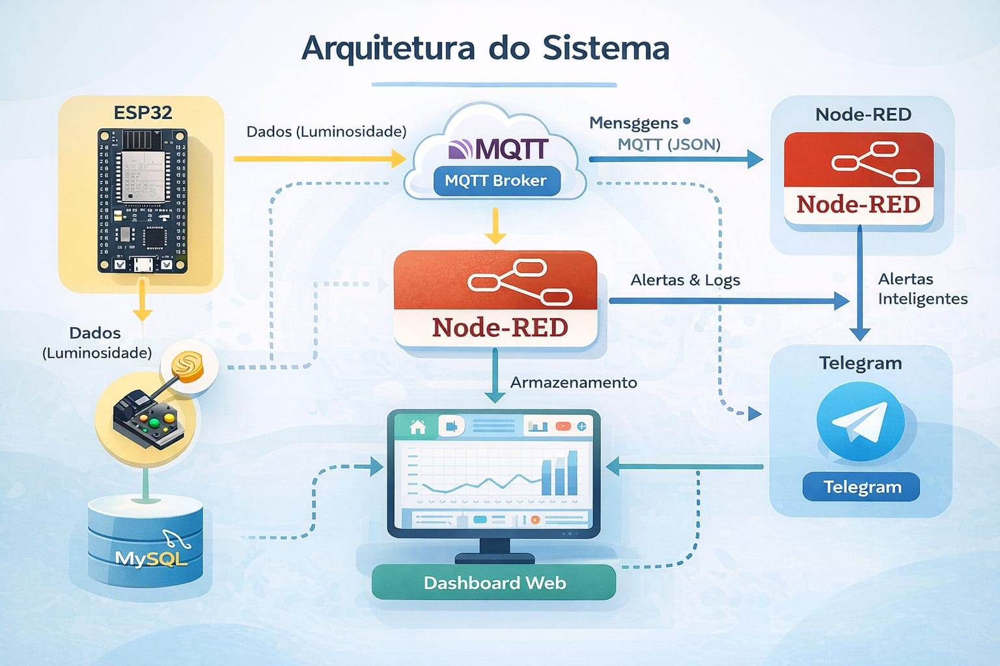
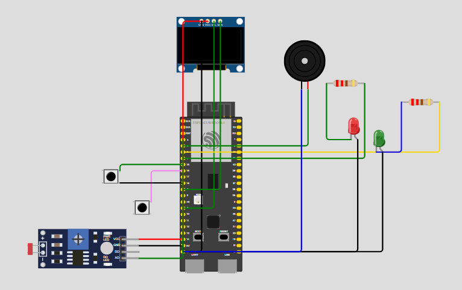
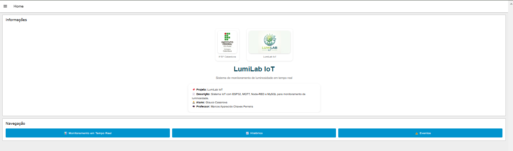
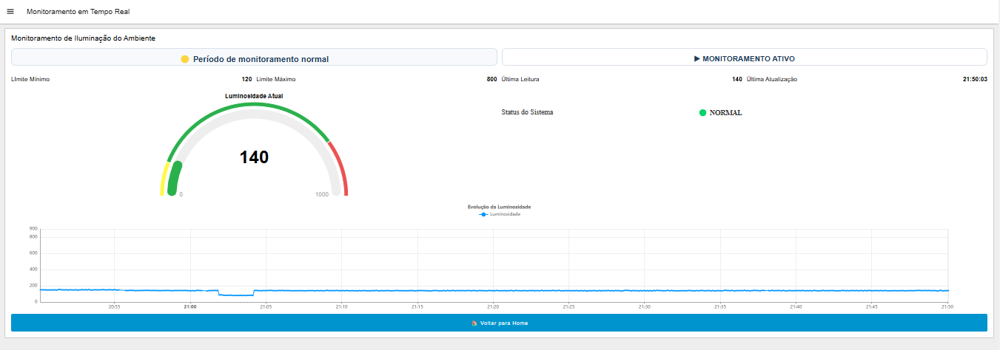
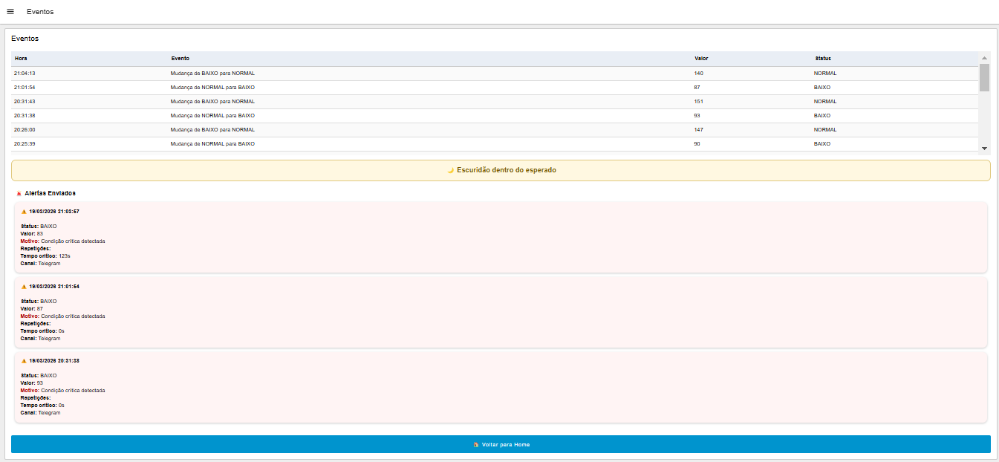
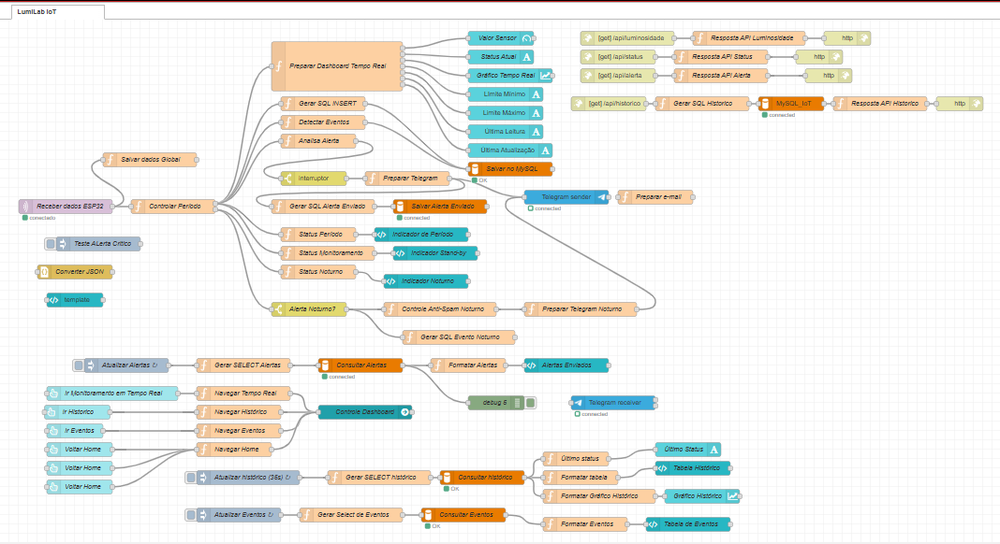

## 🌡️ LumiLab_IoT - Sistema IoT de Monitoramento Ambiental com ESP32 + MQTT + Node-RED

Projeto desenvolvido para monitoramento inteligente de luminosidade em ambientes, com envio de alertas automáticos e visualização em dashboard em tempo real.

---

## 📌 Visão Geral

Este projeto tem como objetivo o monitoramento inteligente da luminosidade em ambientes de cultivo de mudas de plantas in vitro, garantindo condições ideais para o desenvolvimento saudável das culturas.

O sistema utiliza um sensor LDR conectado a um ESP32 para realizar a coleta contínua de dados de luminosidade. Essas informações são transmitidas via protocolo MQTT para uma aplicação em Node-RED, responsável por:

- Processar os dados em tempo real
    
- Detectar condições fora do padrão (anomalias)
    
- Registrar eventos em banco de dados
    
- Enviar alertas automáticos via Telegram
    
- Disponibilizar um dashboard para acompanhamento remoto  

A proposta visa automatizar o controle ambiental, reduzir riscos no cultivo e fornecer suporte à tomada de decisão em ambientes laboratoriais e agrícolas.

---

## 🧱 Arquitetura do Sistema
ESP32 (Sensor LDR) ↓ MQTT Broker ↓ Node-RED ↙       ↘ MySQL     Telegram ↓ Dashboard Web

---

---

## 📁 Estrutura do Projeto
📦 LumiLab_IoT ┣ 📂 firmware ┃ ┗ 📜 esp32_lumilab.ino ┣ 📂 node-red ┃ ┗ 📜 flow.json ┣ 📂 database ┃ ┗ 📜 schema.sql ┣ 📂 images ┃ ┣ 📸 dashboard_tela_home.png ┃ ┣ 📸 dashboard_tela_eventos.png ┃ ┣ 📸 dashboard_tela_monitoramento_real_ativo.png ┃ ┣ 📸 dashboard_tela_monitoramento_real_standby.png ┃ ┗ 📸 flow_node_red.png ┗ 📜 README.md

---

## ⚙️ Tecnologias Utilizadas

- ESP32
  
- Arduino IDE
  
- MQTT (Mosquitto)
  
- Node-RED
  
- MySQL
  
- Telegram Bot API
  
- Dashboard Node-RED

---

## 🔌 Hardware Utilizado

- ESP32
  
- Sensor LDR
  
- Display OLED SSD1306

- LED indicador
  
- Buzzer
  
- Botões de ajuste

---

## 🧠 Funcionamento

O sistema realiza a leitura da luminosidade através do sensor LDR e, com base nos valores obtidos:
Aciona LEDs indicando o nível de iluminação
Emite sinal sonoro via buzzer
Exibe informações no display OLED
Permite interação através de botões

## Explicação Técnica

Sensor LDR

O sensor de luminosidade foi implementado utilizando um módulo LDR, responsável por fornecer um sinal analógico proporcional à intensidade luminosa.

Comunicação I2C

O display OLED utiliza o protocolo I2C, reduzindo o número de pinos necessários para comunicação, utilizando apenas SDA e SCL.

Entradas Digitais

Os botões foram configurados utilizando o modo INPUT_PULLUP, dispensando resistores externos.

Saídas

Os LEDs e o buzzer são controlados por GPIOs do ESP32, atuando como indicadores do sistema.

---

## 🔌 Esquema de Ligações

«⚠️ Observação sobre o sensor LDR:
Na simulação realizada na plataforma Wokwi, foi utilizado um módulo de LDR, que já possui circuito interno de condicionamento de sinal.

Entretanto, no projeto físico original, o sensor foi implementado utilizando um LDR discreto associado a um resistor de 10kΩ em configuração de divisor de tensão, permitindo a leitura analógica pelo ESP32.»

🔌 🔧 PASSO A PASSO

🟢 1. Alimentação

No ESP32:
3V3 →
VCC do OLED
uma ponta do LDR
GND →
GND do OLED
GND do buzzer
GND dos LEDs
GND dos botões
resistor do LDR

🌗 2. LDR

Montagem do divisor de tensão:

3.3V ─── LDR ───┬──→ GPIO 4
                │
             10kΩ
                │
               GND

Coloque o LDR
Ligue:
uma perna → 3.3V
outra perna → uma linha livre
Coloque o resistor 10kΩ
uma ponta → mesma linha do LDR
outra ponta → GND
Agora:
essa mesma linha → GPIO 4
✔️ Resultado:
GPIO 4 recebe sinal analógico
Quanto mais luz → muda a tensão

📺 3. OLED

GPIO 8 → SDA
GPIO 9 → SCL
VCC → 3.3V
GND → GND

🔊 4. BUZZER

GPIO 5 → positivo
GND → negativo

💡 5. LED VERDE

GPIO 6 → resistor 220Ω → LED → GND

🔴 6. LED VERMELHO

GPIO 7 → resistor 220Ω → LED → GND

🔘 7. BOTÃO MAIS

GPIO 16 → botão → GND

🔘 8. BOTÃO MENOS

GPIO 15 → botão → GND

## 📊 Funcionalidades

- Monitoramento em tempo real da luminosidade
  
- Detecção de sub-iluminação e sobre-iluminação
  
- Modo automático de escuridão (noturno)
  
- Alertas inteligentes via Telegram
  
- Registro de eventos no banco de dados
  
- Dashboard interativo
  
- Controle anti-spam de alertas

---

## 🚨 Lógica de Alertas

O sistema envia alertas quando:

- Luminosidade abaixo do mínimo
  
- Luminosidade acima do máximo
  
- Luz detectada em período noturno
  
- Tempo crítico prolongado

---

## 📸 Dashboard

O sistema possui um dashboard desenvolvido em Node-RED para visualização em tempo real dos dados de luminosidade e alertas.

## 🌐 Acesso ao Dashboard

O dashboard do sistema foi desenvolvido utilizando Node-RED e está disponível via navegador web.

O acesso é realizado através de um **proxy reverso configurado com Apache2**, permitindo que a aplicação seja acessada pela porta padrão HTTP (80), ao invés da porta nativa do Node-RED (1880).

🔗 http://3.12.197.220/dashboard/page2

> ⚠️ O acesso pode estar indisponível dependendo do status da instância ou configurações de segurança.

### 🖥️ Tela Principal

### 📈 Monitoramento em Tempo Real

### 📋 Histórico de Eventos

---

## 🔄 Fluxo Node-RED

---

## 🗄️ Banco de Dados

O banco armazena:

- Eventos de mudança de estado
  
- Alertas enviados
  
- Tempo crítico acumulado
  
- Canal de envio

Script disponível em:
database/schema.sql

---

## 📡 Comunicação MQTT

Tópico:
iot/monitoramento_luz

Exemplo de payload:

json
{
  "valor_sensor": 85,
  "status": "BAIXO",
  "periodo": "ESCURIDAO",
  "alerta": true
}

---

🚀 Como Executar o Projeto

1️⃣ ESP32 (Firmware)
Abrir o arquivo:

firmware/esp32_lumilab.ino

Configurar credenciais:

Wi-Fi (SSID e senha)

Broker MQTT (IP do servidor)

Realizar upload para a placa ESP32

2️⃣ Node-RED
Importar o fluxo:

node-red/flow.json

Configurar:
Conexão com broker MQTT

Conexão com banco MySQL

Fazer deploy do fluxo

3️⃣ Banco de Dados
Executar o script:

database/schema.sql

4️⃣ Integração com Telegram
Criar bot via:

@BotFather

Inserir token no Node-RED

Configurar chat_id para envio dos alertas

---

## ⚠️ Pré-requisitos

- Node-RED instalado

- Broker MQTT (Mosquitto)
  
- MySQL configurado
  
- Arduino IDE com suporte ao ESP32

---
  
👨‍💻 Autor:

Projeto desenvolvido por Glauco Casanova

---

📄 Licença
Uso acadêmico e educacional
