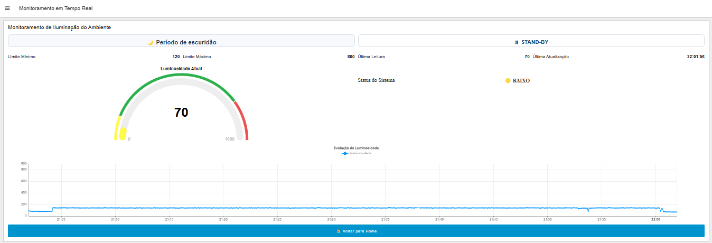

🌡️ LumiLab_IoT - Sistema IoT de Monitoramento Ambiental com ESP32 + MQTT + Node-RED

Projeto desenvolvido para monitoramento inteligente de luminosidade em ambientes, com envio de alertas automáticos e visualização em dashboard em tempo real.

---

## 📌 Visão Geral

Este projeto tem como objetivo o monitoramento inteligente da luminosidade em ambientes de cultivo de mudas de plantas in vitro, garantindo condições ideais para o desenvolvimento saudável das culturas.

O sistema utiliza um sensor LDR conectado a um ESP32 para realizar a coleta contínua de dados de luminosidade. Essas informações são transmitidas via protocolo MQTT para uma aplicação em Node-RED, responsável por:

- Processar os dados em tempo real  
- Detectar condições fora do padrão (anomalias)  
- Registrar eventos em banco de dados  
- Enviar alertas automáticos via Telegram  
- Disponibilizar um dashboard para acompanhamento remoto  

A proposta visa automatizar o controle ambiental, reduzir riscos no cultivo e fornecer suporte à tomada de decisão em ambientes laboratoriais e agrícolas.

---

## 🧱 Arquitetura do Sistema
ESP32 (Sensor LDR) ↓ MQTT Broker ↓ Node-RED ↙       ↘ MySQL     Telegram ↓ Dashboard Web

---

## 🧱 Arquitetura do Sistema

---

## 📁 Estrutura do Projeto
📦 LumiLab_IoT ┣ 📂 firmware ┃ ┗ 📜 esp32_lumilab.ino ┣ 📂 node-red ┃ ┗ 📜 flow.json ┣ 📂 database ┃ ┗ 📜 schema.sql ┣ 📂 images ┃ ┣ 📸 dashboard_tela_home.png ┃ ┣ 📸 dashboard_tela_eventos.png ┃ ┣ 📸 dashboard_tela_monitoramento_real_ativo.png ┃ ┣ 📸 dashboard_tela_monitoramento_real_standby.png ┃ ┗ 📸 flow_node_red.png ┗ 📜 README.md

---

## ⚙️ Tecnologias Utilizadas

- ESP32
- Arduino IDE
- MQTT (Mosquitto)
- Node-RED
- MySQL
- Telegram Bot API
- Dashboard Node-RED

---

## 🔌 Hardware Utilizado

- ESP32
- Sensor LDR
- Display OLED SSD1306
- LED indicador
- Buzzer
- Botões de ajuste

---

## 📊 Funcionalidades

- Monitoramento em tempo real da luminosidade
- Detecção de sub-iluminação e sobre-iluminação
- Modo automático de escuridão (noturno)
- Alertas inteligentes via Telegram
- Registro de eventos no banco de dados
- Dashboard interativo
- Controle anti-spam de alertas

---

## 🚨 Lógica de Alertas

O sistema envia alertas quando:

- Luminosidade abaixo do mínimo
- Luminosidade acima do máximo
- Luz detectada em período noturno
- Tempo crítico prolongado

---

## 📸 Dashboard

### 🏠 Tela Principal

### 📊 Monitoramento em Tempo Real

### 📋 Histórico de Eventos

---

## 🔄 Fluxo Node-RED

---

## 🗄️ Banco de Dados

O banco armazena:

- Eventos de mudança de estado
- Alertas enviados
- Tempo crítico acumulado
- Canal de envio

Script disponível em:
database/schema.sql

---

## 📡 Comunicação MQTT

Tópico:
iot/monitoramento_luz

Exemplo de payload:

json
{
  "valor_sensor": 85,
  "status": "BAIXO",
  "periodo": "ESCURIDAO",
  "alerta": true
}

---

🚀 Como Executar o Projeto
1️⃣ ESP32 (Firmware)
Abrir o arquivo:

firmware/esp32_lumilab.ino
Configurar credenciais:
Wi-Fi (SSID e senha)
Broker MQTT (IP do servidor)
Realizar upload para a placa ESP32
2️⃣ Node-RED
Importar o fluxo:

node-red/flow.json
Configurar:
Conexão com broker MQTT
Conexão com banco MySQL
Fazer deploy do fluxo
3️⃣ Banco de Dados
Executar o script:

database/schema.sql
4️⃣ Integração com Telegram
Criar bot via:

@BotFather
Inserir token no Node-RED
Configurar chat_id para envio dos alertas

---

## ⚠️ Pré-requisitos

- Node-RED instalado
- Broker MQTT (Mosquitto)
- MySQL configurado
- Arduino IDE com suporte ao ESP32
👨‍💻 Autor
Projeto desenvolvido por Glauco Casanova
📄 Licença
Uso acadêmico e educacional
